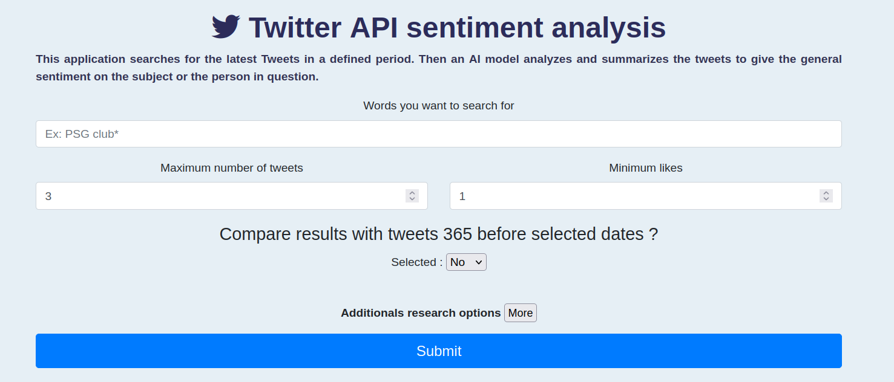
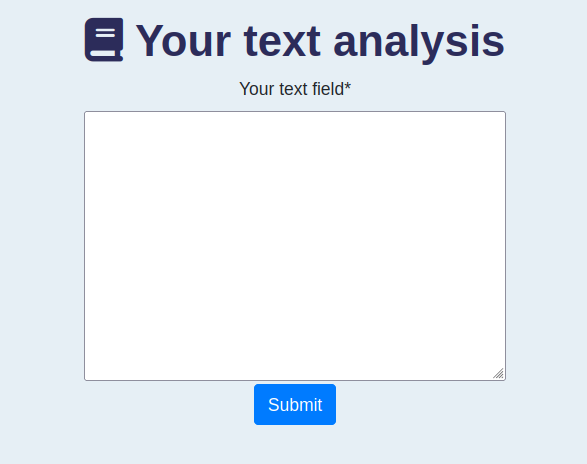
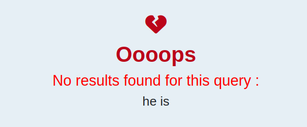

<H1 style="color:rgb(44, 44, 90)", align = "center">
Text analysis
</H1>

Ce site internet permet de réaliser une analyse de sentiment de texte en utilisant trois applications. Pour cela, l'application utilise différents API mobilisant l'intelligence articielle. 

<H1 style="color:rgb(44, 44, 90)", align = "center">
Twitter analysis
</H1>

 
 

Pour cette application nous sollicitons notamment :
- [Edenai](https://www.edenai.co/post/which-sentiment-analysis-api-to-choose-for-your-project) pour analyser la charge émotionnelle des tweets selectionnés
- Le package [snscrape](https://github.com/JustAnotherArchivist/snscrape) pour opérer la requête sur twitter
- Le package [stopwords](https://pypi.org/project/stop-words/) pour chercher les appax permettant de nettoyer le texte récolté. **Note: Nous avons amendé cette liste de nos propres mots** _N'hesitez pas à nous contacter si vous souhaitez ajouter d'autres mots_
- Le package [word cloud](https://pypi.org/project/wordcloud/) pour afficher le nuage de mot afférent

Une fois la requête effectuée, notre application trie les tweets en priorisant les tweets les plus likés (puis les plus retweetés, puis les plus commentés) et renvoie deux pages possibles de résultat :
- Si la recherche trouve au moins un tweet, le résultat est présenté dans la page `result.html`

 
 

- Si la recherche ne trouve pas de tweet, le résultat est présenté dans la page `result_with_no_text`

<u>Conseil d'utilisation pour l'API :</u> 
Il n'y a pas de limite (ni en nombre, ni en date) de requêtes par jour en ce qui concerne la recherche de tweets. Cependant, il faut créer un [compte](https://app.edenai.run/user/login?referral=sentiment-analysis-how-to) pour réaliser l'analyse de sentiments et renseigner la key obtenue. Le site propose alors un crédit de 10 dollars à consommer selon l'utilisation.

<H1 style="color:rgb(44, 44, 90)", align = "center">
Your text analysis
</H1>

Pour cette application nous sollicitons notamment :
- [Edenai](https://www.edenai.co/post/which-sentiment-analysis-api-to-choose-for-your-project) pour analyser la charge émotionnelle des tweets selectionnés
- Le package [langid](https://pypi.org/project/langid/) pour détecter la langue du texte envoyé
- Le package [stopwords](https://pypi.org/project/stop-words/) pour chercher les appax permettant de nettoyer le texte récolté. **Note: Nous avons amendé cette liste de nos propres mots** _N'hesitez pas à nous contacter si vous souhaitez ajouter d'autres mots_
- Le package [word cloud](https://pypi.org/project/wordcloud/) pour afficher le nuage de mot afférent

Une fois la requête effectuée, notre application nettoie le texte, supprime les stowords et renvoie deux pages possibles de résultat :
- Si le texte nettoyé contient au moins un caractère, le résultat est présenté dans la page `your_text_result.html`

- Si le texte nettoyé contient zéro caractère, le résultat est présenté dans la page `result_with_no_text`

 
 

