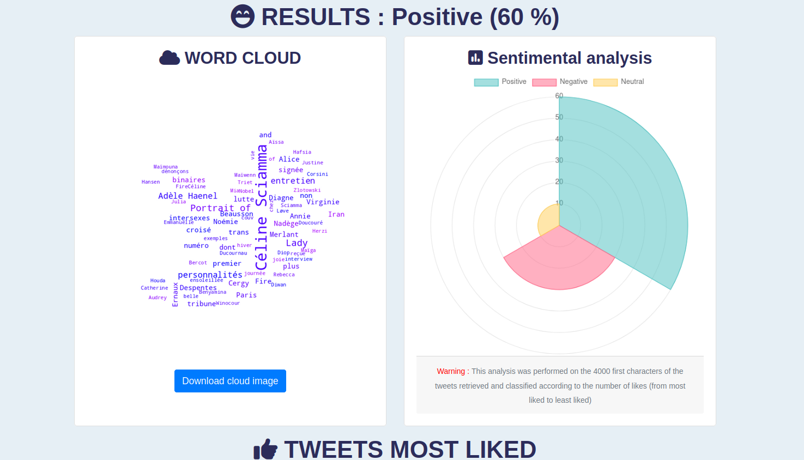
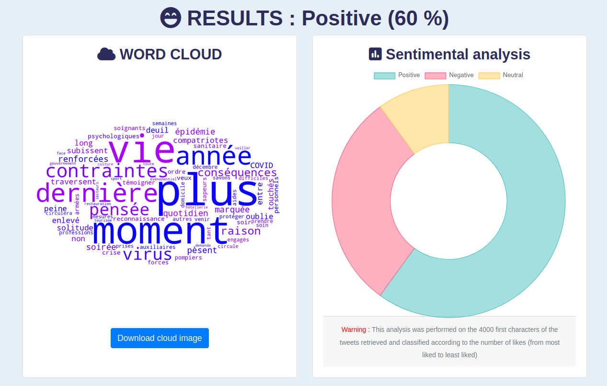
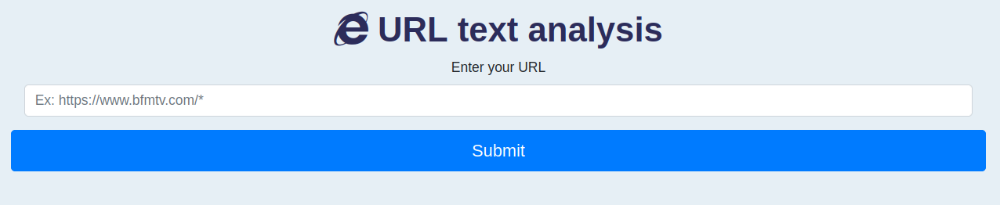

<H1 style="color:rgb(44, 44, 90)", align = "center">
Text analysis
</H1>

This website helps to perform a text sentiment analysis using three applications. For this, the site uses different APIs mobilizing articial intelligence. 

<u>Usage advice for APIs :</u> 
There is no limit (neither in number nor in date) of requests per day regarding the search for tweets or the sending of texts.However, you must create an [account](https://app.edenai.run/user/login?referral=sentiment-analysis-how-to) to make the analysis of feelings and inform the key obtained. The site then offers a credit of 10 dollars to be consumed according to the use.

<H1 style="color:rgb(44, 44, 90)", align = "center">
Twitter analysis
</H1>

 
 

For this application we require :
- [Edenai](https://www.edenai.co/post/which-sentiment-analysis-api-to-choose-for-your-project) to analyze the emotional charge of selected tweets
- [Snscrape](https://github.com/JustAnotherArchivist/snscrape) to make the request on twitter
- [Stopwords](https://pypi.org/project/stop-words/) to search for appax to clean the collected text. **Note: We have amended this list with our own words** _Don't hesitate to contact us if you wish to add other words_
- [Word cloud](https://pypi.org/project/wordcloud/) to display the related word cloud

Once the query is done, our application sorts the tweets by prioritizing the most liked tweets (then the most retweeted, then the most commented) and returns two possible result pages :
- If the search finds at least one tweet, the result is presented in `result.html`

 
 

- If the search doesn't find a tweet, the result is presented in `result_with_no_text`

 
 

<H1 style="color:rgb(44, 44, 90)", align = "center">
Your text analysis
</H1>

 
 

For this application we require :
- [Edenai](https://www.edenai.co/post/which-sentiment-analysis-api-to-choose-for-your-project) to analyze the emotional charge of selected tweets
- [Langid](https://pypi.org/project/langid/) to detect the language of the text sent
- [Stopwords](https://pypi.org/project/stop-words/) to search for appax to clean the collected text. **Note: We have amended this list with our own words** _Don't hesitate to contact us if you wish to add other words_
- [Word cloud](https://pypi.org/project/wordcloud/) to display the related word cloud

Once the request is made, our application cleans the text, removes the stowords and returns two possible result pages :
- If the cleaned text contains at least one character, the result is presented in `your_text_result.html`

 
 

- If the cleaned text contains zero characters, the result is presented in `result_with_no_text`

 
 

<H1 style="color:rgb(44, 44, 90)", align = "center">
URL text analysis
</H1>

 
 

For this application we require :
- [Edenai](https://www.edenai.co/post/which-sentiment-analysis-api-to-choose-for-your-project) to analyze the emotional charge of selected tweets
- [Langid](https://pypi.org/project/langid/) to detect the language of the text sent
- [Stopwords](https://pypi.org/project/stop-words/) to search for appax to clean the collected text. **Note: We have amended this list with our own words** _Don't hesitate to contact us if you wish to add other words_
- [Word cloud](https://pypi.org/project/wordcloud/) to display the related word cloud

Once the URL link is sent, our application retrieves the text of the web page, cleans it, removes the stowords and returns two possible result pages :
- If the cleaned text contains at least one character, the result is presented in `upload_file_result.html`

 
 

- If the cleaned text contains zero characters, the result is presented in `result_with_no_text`

 
 

<H3 style="color:rgb(255, 44, 44)">
Warning :
</H3> 
The spider can not access some websites, including comments on the youtube site or sites requiring a login (eg email).