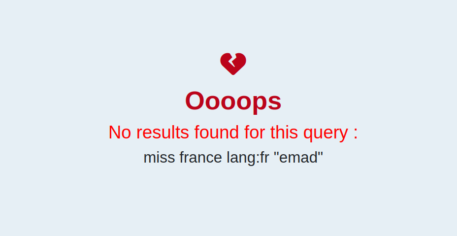

<H1 style="color:rgb(44, 44, 90)", align = "center">
Twitter API sentiment analysis
</H1>

Cette application permet à partir d'une recherche des derniers n tweets (n à définir par l'utilisateur) d'opérer une analyse des sentiments. Pour cela, l'applciation mobilise différents API mobilisant l'intelligence articielle. 

Nous sollicitons notamment :
- [Edenai](https://www.edenai.co/post/top-10-sentiment-analysis-apis) pour analyser la charge émotionnelle des tweets selectionnés
- Le package [snscrape](https://github.com/JustAnotherArchivist/snscrape) pour opérer la requête sur twitter
- Le package [stopwords](https://pypi.org/project/stop-words/) pour chercher les appax permettant de nettoyer le texte récolté. **Note: Nous avons amendé cette liste de nos propres mots** _N'hesitez pas à nous contacter si vous souhaitez ajouter d'autres mots_
- Le package [word cloud](https://pypi.org/project/wordcloud/) pour afficher le nuage de mot afférent

Une fois la requête effectuée, notre application renvoie deux pages possibles de résultat :
- Si la recherche trouve au moins un tweet, le résultat est présenté dans la page `result.html`

- Si la recherche ne trouve pas de tweet, le résultat est présenté dans la page `result_with_no_text`

Conseil d'utilisation pour l'API
Il n'y a pas de limite (ni en nombre, ni en date) de requêtes par jour en ce qui concerne la recherche de tweets. Cependant, il faut créer un [compte](https://app.edenai.run/user/register?referral=best-sentiment-analysis-apis) pour réaliser l'analyse de sentiments. Le site propose alors un crédit de 10 dollars à consommer selon l'utilisation.

API : 

1. On prend les tweet
2. On les joins+nettoyer pr analyser le texte global -> comment supprimer émojis, " ", appax (il elle, ...)
3. On analyse le sentiment global de ce texte
4. On présente les n tweet les plus likés, les plus retweetés, les plus replayés (commenté)

Todo :
1. DONE : Ajouter un masque : affiché dans un nuage de mots
2. DONE: Ajouter un button pour télécharger le nuage
3. implémenter l'api
4. afficher en rouge si négatif, afficher en vert si positif
5. créer une fonction pour faire tourner même sans l'api
6. explorer la possibilité d'analyser facebook, instagram
Chercher un moyen de reconnaitre le sexe du posteur de tweet
Historique des sentiments pour la même période
Créer un forum django pour demander key propre de chaque utilisateur

Axe amélioration:
Stop word pour les langues qui n'utilisent pas le même alphabet